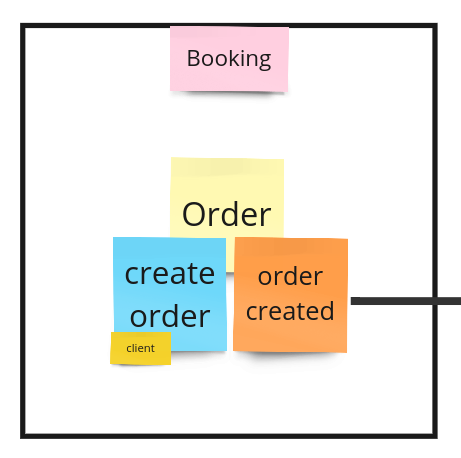
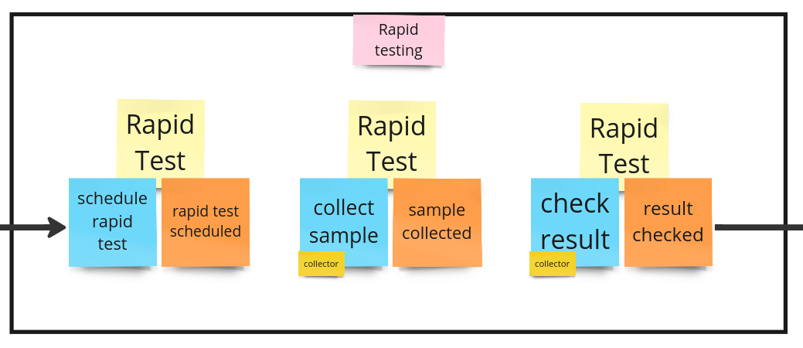
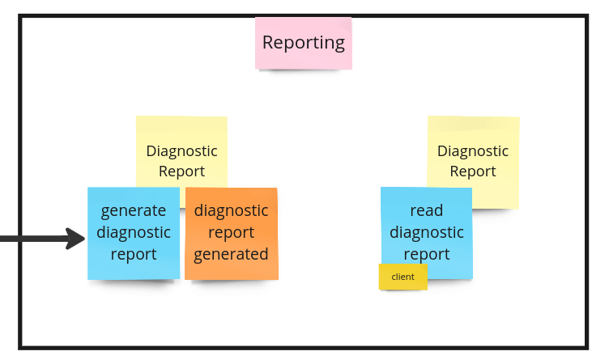

# Event Outbox Example

This is a proof-of-concept example of [event-outbox](https://github.com/returnnullptr/event-outbox) python package.

## Bounded Contexts

### Booking



### Rapid testing



### Reporting



## Installation

With [poetry](https://python-poetry.org/):

```bash
poetry install
```

## Running

```bash
poetry run uvicorn example.infrastructure.http_server:create_app --factory
```

## Development

```bash
bash cleanup.sh
```
